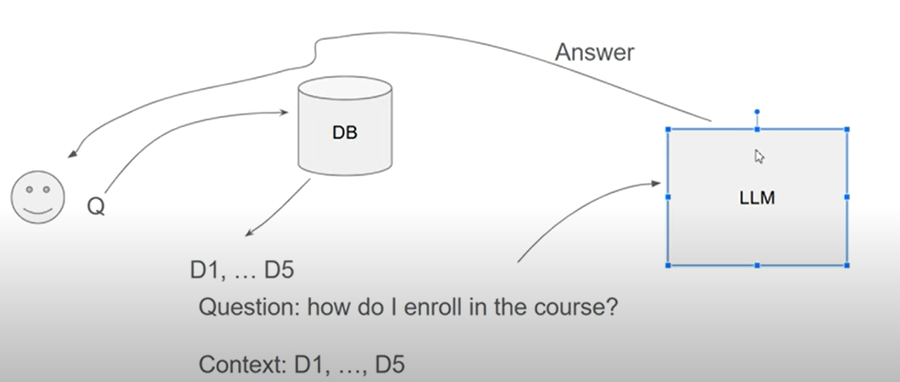

# Lesson 1: Introduction

## What is LLM and RAG?
### Language Model 
- models that can predicts the next word
### Large Language Model (LLM)
- language models that was trained with large amount of data
- can able to predict the next word, but it can mimics how human communicates
- receives an input (Prompt) and provides an output (Response)

### Retrieval Augmented Generation (RAG)
* Retrieval - search; to provide more context with the LLM; usually these are the knowledge base
* Generation - LLM to create answer based on the given context

*How does RAG Framework works?* <br>

1. user will provide question (prompt)
2. send the prompt to the DB
3. retrieve the documents from the DB
4. documents will provide context to the LLM
5. based on the context, LLM will generate the answer (response) to be provided to the user

## Preparing the environment

Setup OpenAI API key within the environment variable
1. Go to platform.openai.com
2. Go to API Keys
3. Generate and copy the secret key
4. Run on command line
    ```
    export OPENAI_API_KEY="generated api key"
    ```
Setup virtual environment
1. open command line and run the following:
    ```
    pip install virtualenv
    ```
2. once installed, run again the following:
    ```
    virtualenv venv
    source venv/bin/activate
    ```


